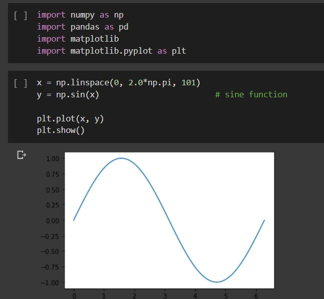
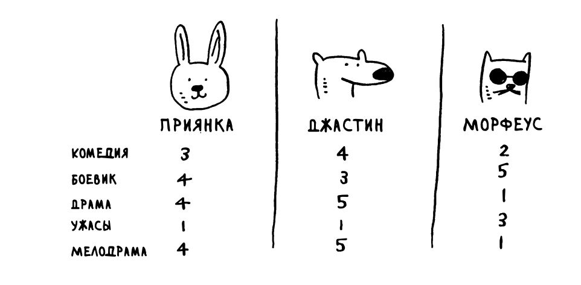
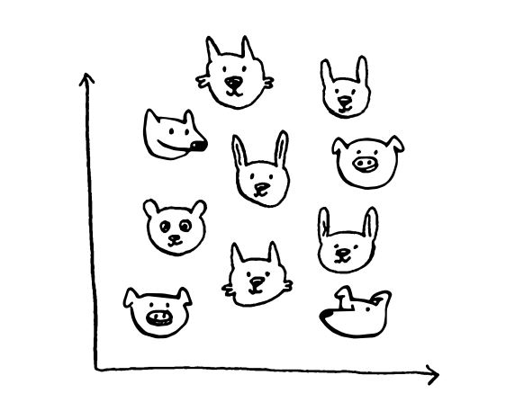
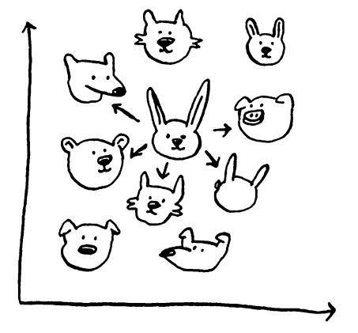
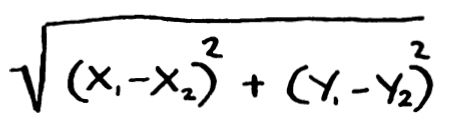
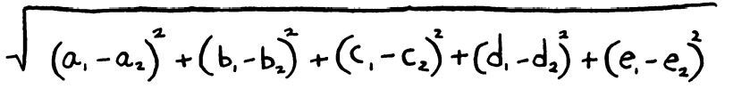
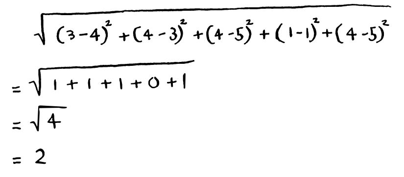
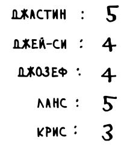
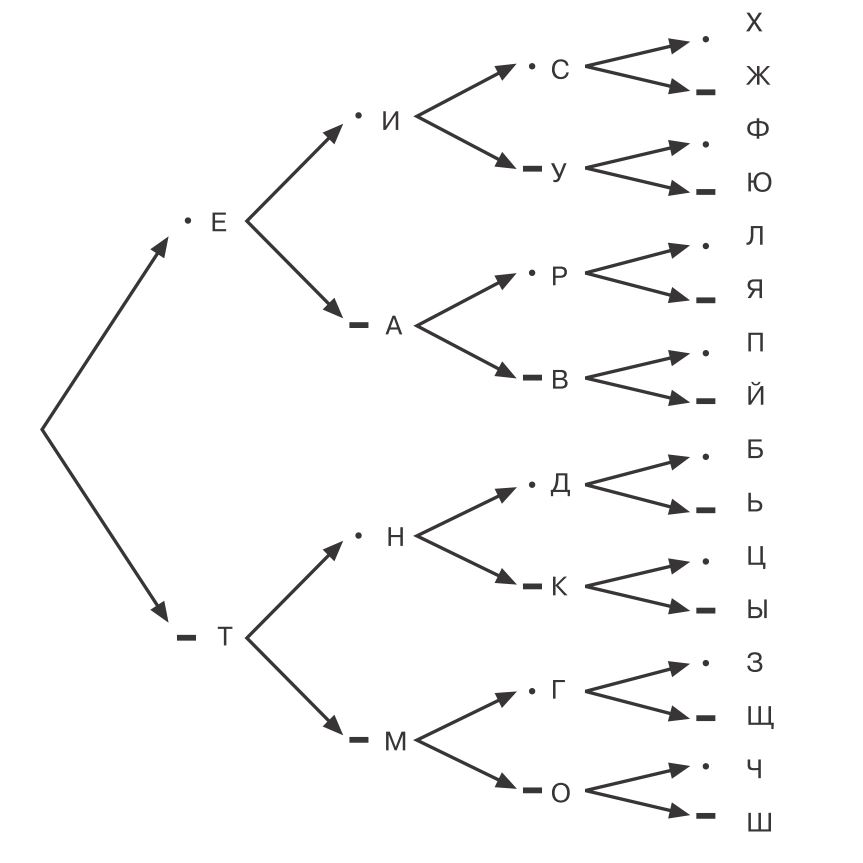

> # Меня зовут Дмитрий, это мой блог, надеюсь это будет описание пути от нуба в профессионалы IT  :)
>

|[**Mоё резюме на hh.ru**](https://vologda.hh.ru/resume/ff6aba3fff0857b2030039ed1f4b55414b6166)|[**Моё CV (сurriculum vitae)**](https://konicaru.github.io/cv/)|Связаться со мной: [**dimkonica@gmail.com**](dimkonica@gmail.com)|

|[**Мой GitHub**](https://github.com/konicaRu)|[**Мой Linkedin**](https://www.linkedin.com/in/dimkochetov/)|[**Мой Facebook**](https://www.facebook.com/konica1970)|[**Телеграмм**](https://t.me/konica1970)|

------

## Большой брат следит за тобой

### визуализация данных о себе в Tableau .

15.03.21


> ###  отчет

Я конечно предполагал что мои перемещения можно отследить если подключится к телефону или по перемещению между базовыми станциями по регистрации в мобильной сети. Но вот убей не знал что все перемещения телефон накапливает прям в аккаунте гугла с координатами со временем с момента как вы его завели. Гугл конечно пишет что дело это сугубо добровольное и вы можете отслеживание отключить в `истории местоположений`, но вы же этого не делаете, да кто обращает внимание на такие мелочи:)) Но раз есть данные значит их можно визуализировать и я решил попробовать визуализировать свои перемещения в Tableau.

Все открытые данные которые гугл собирает о вас он хранит в [*Google Архиваторе*](https://takeout.google.com/) . в файле формата `.json`


вот так он выглядит как видно все данные тут как на ладони и перемещение и время и точность, высота, скорость, всё как на духу в общем выложил :))


Можно загружать в Tableau, но нужно немного поправить формат координат и времени...и да, Tableau файлы `.json`больше 128 мб не воспринимает поэтому нужно его подрезать например в блокноте.

пересчитываем координаты


время


и получаем вот такой результат, довольно интересно :)) по ссылке [рабочая версия](https://public.tableau.com/profile/dim6669#!/vizhome/shared/Q78KDRD83).


------


## Отчет о обучении на курсе Аналитик данных.

06.02.21


> ###  отчет

Если кому то лень читать все сразу напишу вывод: Курсы в общем мне понравились, если вы спросите готов ли я рекомендовать эти курсы вам и своим знакомым , то да я готов их рекомендовать. Пока правда я их только закончил еще даже не получил сертификат так что не могу сказать насколько я готов к реальной работе. Но как устроюсь постараюсь дополнить отзыв. 

Теперь сам отзыв: Перед тем как зайти на курсы Яндекс практикума я взял пробный курс от конкурентов и хочу сказать что Практикум впечатлил меня больше. На тот момент надо сказать бесплатная вводная часть в свободном доступе была только у Яндекса. Также только у Яндекса можно было платить за курс помесячно. Все остальные предлагали только кредит от банков партнеров. То есть если ты решил прервать учебу до окончания курса, ты оставался должен банку.

Как построено обучение в Яндекс Практикуме: Само обучение происходит в их собственном тренажере, никакого видео только текст , только хардкор :)). И это я хочу сказать работает. Сначала дается теория потом теория закрепляется написанием кода в этом же тренажере. Иногда возникают проблемы , так как ты занимаешься этим первый раз затыки в выполнении заданий неизбежны и тут мы видим еще один большой плюс Практикума поддержка реальных специалистов по твоей специальности в Slack. Можно задать любой вопрос в чате и в течении пары часов получить ответ и объяснение того что ты не понял. Также за тобой закреплен личный менеджер который решает все организационные проблемы. 

Курс разделен на 12 частей на 12 тем в конце каждой темы выполняем самостоятельно проект-исследование по теме , как нам говорят, приближенный к реальной работе. Проект проверяют специалисты пишут замечания ты исправляешь они снова пишут и так до тех пор пока их твой проект не устроит. 

Где то после прохождения ⅔ обучения Студенты по желанию проходят программу акселерации, действующие HR проводят видеоконференции, учат вас писать резюме и сопроводительные письма, формировать портфолио в GitHub, проводят пробное собеседование. По всем тренировкам HR дают подробный feedback. Это очень круто. По окончании обучения программа трудоустройства продолжается, я очень надеюсь что она мне поможет устроиться на работу по полученной специальности. 

Не могу не сказать о духе курсов:)) Всё очень доброжелательно, студенты в общих чатах обмениваются полезной информацией которую смогли найти, взаимопомощь там тоже не пустой звук, помогают не только тьюторы, но и коллеги по учебе, ну и конечно стараешься помочь сам. ибо “Таков путь…!” 


------

## Книга: "Все лгут" Сет Стивенс-Давидовиц

03.02.21


> ###  прочитал  

Еще одна интересная книга , хотя и с налетом популизма. Книга о стереотипах и критическом мышлении. Как изменение подхода меняет устоявшуюся картину. В этой книге автор подверг сомнению много устоявшихся стереотипов применив для их проверки несколько интересных подходов. Один из них, анализ поисковых запросов на различных сайтах, Google, Pornohub и другие. Как правило исследую какое то явление ученые прибегают к выборочному опросу и транслируют результат на всю целевую группу. Но насколько правдиво люди отвечают на вопросы? 

Как вариант сравнили результаты опроса как часто люди пользуются презервативами. Если согласно опроса  посчитать количество используемых в год презервативов то их количество в 4 раза превышало продажи. То есть люди очень сильно при опросе завышали количество занятий сексом. И да естественно результаты опроса не соответствовали действительности.

Еще стереотип: что наибольших успехов  в спорте достигают дети из бедных семей (это мнение поддерживается фильмами типа "Рокки" и прочими, но с кино все понятно слезливая история о восхождении на вершину бедного мальчика наберет больше денег, чем та же самая но только рассказывающая о восхождении мажора :)) Но нет, статистика нам говорит о обратном, как раз наибольших успехов добиваются спортсмены из семей с хорошим достатком. Хотя конечно есть исключения, но в пределах статистической погрешности.

Ну и очень красивый анализ ситуации с безработицей в Америке. Как вы думаете с чем коррелируют данные о увеличении уровня безработицы? С увеличением анкет на сайтах по трудоустройству? А вот нет с увеличением траффика на Pornohub, ну действительно чем еще безработному заняться как не порнуху посмотреть:)) 

Очень интересные анализы в книги, интересные и неожиданные корреляции одних событий с другими. Мне понравилось рекомендую к прочтению.


------


## Книга: "Графики которые убеждают всех" Александр Богачев

08.01.21


> ###  прочитал  

Продолжаю учебу на курсах Яндекс Практикум по специальности Аналитик Данных. Один из востребованных скиллов аналитика  это визуализация данных. И вот чтобы повысить этот скилл была прочитана это книга

Автор пишет что это первая книга на русском языке о построении графиков, не проверял спорить не буду. Но мысли и идеи в ней изложенные интересны и я считаю полезны для человека который визуализирует данные.

Суть визуализации данных – в переводе чисел на язык графических образов. Иными словами, в кодировании числовых значений визуальными объектами. Еще проще рисования различного вида графиков. Графиков есть очень много типов. Проблема в том что для разных типов цифровых данных подходят разные типы графиков. 

Книга рассказывает о том  как сделать более наглядный, эффективно работающий или рассказывающий историю график. Разобрано большинство типов графиков и  в визуализации каких данных их уместно применять. Приведены примеру неудачных визуализаций каждый пример подробно разобран и даны рекомендации как надо. Не обошёл автор вниманием такие мелочи как шрифты в текстах и аннотациях их расположение на графиках и даже межстрочный интервал. Цветовые гаммы понятно тоже рассмотрены. В общем всем имеющим отношение к визуализации мои рекомендации :))


------

## Книга: "СПИН-продажи" Нил Рекхем

02.12.20


> ###  прочитал  

На самом деле мы всю жизнь кому-нибудь что-нибудь продаем. Вот в данный момент я пытаюсь продать самого себя , то есть устроиться на работу, то есть продать себя подороже :)) Я как и все, всю жизнь кому то что то продавал. Но подойти к этому профессиональной точки зрения как то мне в голову не приходило, шло все само сбой, ну и ладно. Я пришел к прочтению этой книги думая дополнительно заняться новым бизнесом. 

Была интересная идея , сервис позволяющий производить оплату лайками. Все равно все фоткают места которые посещают ,все равно все бьются (ну может быть не все, но большинство) за лайки. Одно условие надо поставить хэштег заведения, сервис посчитает лайки ваших друзей под постом и соответственно заведение сможет сделать вам скидку на это количество лайков так как вы его хэштегом прорекламировали. Интересная была идея, вроде как вполне очевидная выгода для заведения, взялся я этот сервис продвигать у нас в городе.

Так как к вопросу я хотел подойти серьезно. По совету знакомых продажников перед тек как начинать продвижение сервиса и назначать встречи прочитал   "СПИН-продажи" Нила Рекхема.

Вкратце основная идея книги, выводишь клиента на то чтобы он рассказал тебе о своей боли, естественно не обо всех , а той которую решает твой продукт и предлагаешь решение. Или перед встречей ты точно выясняешь что боль есть и тогда прям с ходу можно с козырей зайти например так :)))

> **«Константин Леонидович, вы занятой руководитель,** **и, я уверен, вы сейчас задаетесь вопросом, стоит ли уделить полчаса вашего времени** **разговору  со  мной.  Однако  если  в  результате  вы  сможете  сэкономить  своей  компании несколько десятков тысяч рублей, думаю, вы согласитесь, что время не будет потрачено зря…»**

Например в пивбаре у меня был такой диалог. Я спрашивал хозяина рекламируется ли он в соцсетях, каких соцсетях, сколько стоит. А потом спрашивал его  не хотел бы он чтобы его клиенты сами рекламировали его? Идея в том чтобы человеку в принципе нечего было тебе возразить так как он сам тебе рассказал о этой проблеме. Но и работа с возражениями в книге тоже описана.

Естественно каждую встречу я заносил в гугл док с описанием что я сказал что мне ответили, какие были возражения , старался все анализировать вот [тут](https://docs.google.com/document/d/1x4BCMotapSnkaMklVXudJP5F2cwgs-swvGh7uDTFS2M/edit?usp=sharing)  описание моего взаимодействие с пивбаром

Книга интересная, многое из того что прочитал применяю и в обычной жизни, рекомендую к прочтению.

[Здесь](https://docs.google.com/document/d/19xbmPzPvCFPVQrDoHODE6QA-O2-jStwmm_harUF10vI/edit?usp=sharing) небольшой бонус мой план подготовки к спин продажам. 


------


## Почему я решил стать аналитиком данных.

25.11.20


> ###  мысли

Сначала я не знал что всем что я знаю сейчас занимается аналитик данных. В моем понимании это было все гораздо уже , ну мб проанализировать какого цвета сапоги пользуются успехом у дам в определенном возрасте. Девять лет я работал директором сети фотосалонов и все это время проблема прибыльности конторы, вот не здесь и сейчас, а как я сейчас знаю с учетом купленного товара который будет продан потом вот как это учесть , но знаниями на тот момент я не обладал. Дали рекламу на радио как она отработала? Оправдала себя или нет, было не очень понятно , но положено давать рекламу вот ее и давали….как это посчитать в цифрах было интересно и необходимо, но на тот момент не ясно как. 

Дальше было 10 лет полностью предпринимательской деятельности. Все сам, ведешь сайт, реклама в Яндекс Директ, СЕО оптимизация, Google AdWords. И опять непонятно. Вроде хочешь поменять дизайн сайта или поменять текст в рекламном объявлении , но как это отразиться на продажах? О АА и АБ тестировании тогда краем уха слышал , но сам применить не мог , а многочисленные рекламные конторы в которые обращался не предлагали. Делал все сам что то читал что то чисто на интуиции. Очень хотелось все это делать самому, узнать прибыльно или нет , есть ли вообще перспектива. Оказалось что за всем этим смотрит аналитик данных. Ну и раз я давно хотел этим заняться, я пришел в аналитику, оценивать изменения, решать насколько прибыльными они оказались, предсказывать что будет если сделать так, мне это интересно я хочу этим заниматься…..


------


## Экономим время на кодинге, ленивый кодинг, лайф хак так сказать :)

05.11.20


> ###  life hack

Когда кодишь печатаешь много одинакового, например `print`, `for`, `display`, `.head`, `return` Мне вот стало лень все это каждый раз печатать. Стал смотреть как можно избавить себя от этой рутины. Что нашел, старая прога от Яндекса **Punto Switcher.** Во вкладке `автозамена` забиваем все что хотим напечатать. Достаточно нажать две клавиши. Я беру первую букву, что хочу напечатать и + tab. То есть если нужен  `print` нажимаем  `p+tab`, нужен `display` `d+tab` Или например у меня   

`<div class="alert alert-info">`

`</div>` 

забито на `w+tab`


удобно , быстро. И основная функция у него менять раскладку, тоже пользуюсь, замена по выделению. Ошибся с раскладкой выделил строку нажал `insert` текст поменялся на нужный и не надо перепечатывать


------


## Книга: "Варгань, кропай, марай и пробуй" Шрини  Пиллэй

07.10.20


> ###  прочитал  

Сначала читаешь умную книгу, `вот эту`: [В работу с головой](https://konicaru.github.io/#книга-в-работу-с-головой-кэл-ньюпорт) , чтобы решить свои проблемы с концентрацией. И прочитав веришь , а через пол года читаешь другую умную книгу в которой, ну не то чтобы кардинально , но подается совсем другой способ достижения результата.

В "Работе с головой" всё подано так что....убеги, запрись где - нибудь в пещере, комнате, на необитаемом острове, чтобы никто не мешал и работай, работай не отвлекаясь. Все же , блин, гении так делали..... И куча примеров, вот он гений раз, а вот гений два , три и так далее....

В "Кропай и пробуй" всё по другому. Поработал, отдохни, расслабься, погуляй и куча примеров что умный мысли они во время расслабления приходят и проблемы решаются. 

Второй способ мне ближе, если какой то затык в работе , не раз замечал, пошел на прогулку и как то само собой,  вроде и не гоняешь специально мысли о проблеме , но мозг на подсознательном уровне видимо работает и раз ..осенило :))) решен вопрос.

Еще интересного подчерпнул. Всю свою немалую жизнь придерживался принципа: Не надо мечтать, говорить о том что задумал, ну типа спугнешь, не сбудется. А надо не так, надо говорить и мечтать, таким образом мы мысленно программируем себя на успех и все получится. Ниже цитата как раз про это. Прочитайте книгу , интересная , мне понравилась.

### Цитата из книги:

> Воображая, что двигаетесь, вы стимулируете те же участки мозга 62 , которые работают, когда вы фактически двигаетесь. При этом движения не осуществляются, потому что фантазии —  слабый стимул либо этому препятствуют другие участки 
> мозга. Если скомандовать ему двигаться, то он подчинится.
>
> Попробуйте  следующее:  выберите  от  одного  до  трех  образов своей цели. 
>
> - если это хорошее здоровье, то представьте, как пересекаете финишную черту, пробежав марафон. 
>
> - если хотите гармоничных отношений, то вообразите себя лежащим рядом с кем-то и испытывающим удовольствие от жизни. 
>
> - а если мечтаете о деньгах, то подойдет что-нибудь, говорящее о том, на что вы бы их потратили: вы делаете благотворительный взнос, покупаете маме дом или отправляетесь в увлекательную поездку.  
>
>   Но когда желание создает скрытый внутренний конфликт —  например, это настолько крупная сумма, что вы не верите в возможность ее получить, —  есть риск подсознательно саботировать собственные усилия.


------


## Курс [Яндекс Практикум](https://praktikum.yandex.ru), аналитик данных.

29.09.20

 

> ###  трудности  и мотивация

Хочу рассказать о то что помогает мне учиться и не позволяет бросить обучение. 

Первое это конечно деньги , деньги заплатил теперь надо учится , жаба то душит :)))) бросишь учебу , деньги потеряешь. Но нет :)) это шутка на самом деле. Как раз в яндексе можно платить помесячно, но дело не в этом :)).  

Я проходил не одни курсы за все это время, тут вот можно посмотреть путь длинною в полтора года https://github.com/konicaRu/My_learning_tracker

Что мотивирует:

> Очень хорошо мотивирует обратная связь от создателя или куратора курса, поддержка живых людей с кем можно списаться задать вопрос просто пообщаться. Хорошо когда это общение встроено прям в процесс обучения, те ты общаешься не только когда у тебя какая то проблема а прям процесс связан с общением. В Яндекс Практикуме процесс обучения построен именно так.

Основная сложность для меня, 

> это когда что то не получается, вот как раз то что я описал выше эту сложность решает.

Ну и конечно должна быть внутренняя мотивация , понимание что тебе это нужно, что с этим ты решил связать свое будущее. Если этого нет тогда и деньги не имеет смысла тратить и время......


------


## Отзыв о курсе [Яндекс Практикум](https://praktikum.yandex.ru), аналитик данных.

16.09.20

 

> ###  начало 

Ниже писал как с моей точки зрения правильно выбирать обучающие курсы. Сейчас я прохожу обучение на курсах Яндекс практикум. Думаю по мере прохождения писать отзывы как все проходит может быть кому то будет полезно. Ну там плюсы минусы и общие впечатления. Курсов там много, по разным IT и не только специальностям (лучше если интересно пройдите по ссылке в заголовке и посмотрите сами). Первое что понравилось в курсах, начать проходить их ты можешь бесплатно на их собственном тренажере, кроме того тебе будет обеспечена поддержка от самого яндекса. То есть  если какой то затык в упражнении обращаешься в удобный для тебя канал связи(любой мессенджер, я общался через телеграмм) и получаешь помощь, ну как помощь как правило происходит затык с заданием которое ты не можешь решить и тебе подсказывают как правильно. Кроме того есть косвенная подсказка  в самом тренажере, так что обращаться да помощью часто не приходится.  

выглядит это примерно так:


 У них есть определенные проблемы с тренажером кое где задание нужно решить строго одним способом, в программировании как известно сколько программистов столько и вариантов решения, поэтому вот в этом случае поддержка очень помогает. Пробные курсы можно пройти по любой представленной специальности , можно оценить к чему у тебя лежит душа. Я попробовал Тестировщика данных, но там прям таким въедливым надо быть, что засомневался я в своих способностях :))), а пробный курс проходится достаточно просто и занимает всего 4 месяца обучения и стоит дешевле остальных. У Яндекса на момент моего поступления на курс был еще один большой плюс, можно было платить по мере прохождения, заплатил за месяц и идешь его. У всех остальных либо 100% предоплата либо бери кредит в банке. Проблема в том что если вы вдруг по какой либо причине решите курс покинуть деньги вам в этом случае вернут с большой потерей (я уж не говорю про кредит в банке), а в Яндексе да, пусть подороже получается , но и возможностей для манёвра в таком случае больше, удобнее.

Каждый конечно может попробовать, но кому лень я опишу процесс обучения на пробных курсах Яндекса. Сначала в читаете теоретическую часть (никаких видео, только хардкор :)), затем по прочитанному материалу выполняете задание на их сервере по программированию. 

Выглядит это так:


Вы реально пишете микропрограммы сервер их проверяет в автоматическом режиме, если все верно идете дальше если нет, долбите до победного , ну или идете в саппорт за помощью :). Такой принцип обучения мне понравился. 

Перед этим я договорился пройти пробный курс по нейронным сетям в [SkillFactory](https://skillfactory.ru) За пять тысяч рублей, которые вам потом вернут если вам курс не понравился я получил недельный доступ. Вот у них процесс обучения мне не зашел, вроде и видео с преподавателями у них, но закрепление материала кое где из раздела "выбери правильный ответ из трех вариантов". А где то прям резко перескакивает на сложную тему и возникает ощущение что ты что то пропустил, чего то тебе не договорили, в общем отказался я от них и попросил вернуть деньги, деньги вернули без проблем.  Далее расскажу о платной части курса......


------

## Как я выбирал курсы программистов.

08.09.20

.jpg)

> ###  обзор 

До с мая 2006 года и до мая 2019 года я занимался прокладкой внешних инженерных коммуникаций, водопроводы газопроводы и тд. методом [горизонтального направленного бурения](https://ru.wikipedia.org/wiki/Горизонтальное_бурение) . Но ситуация в экономике становилась все хуже, стройка падала и вот уже приходится балансировать на грани хватит ли денег на зарплату персонала. Так как такая ситуация в корне меня не устраивала, принял решение завязать со строительством. Мечта была  стать программистом и лет пять назад на платформе https://javarush.ru/ я пробовал по совету друзей айтишников затащить язык java. В то время курсов в отличие от сейчас было очень мало, вот этот ресурс все что я смог найти из более менее приличного. Но к сожалению так как он был построен по принципу тренажера без обратной связи в какой то момент я не смог пройти очередное упражнение и все встало. Курсы пришлось бросить. Год назад когда я искал курсы программирования все стало гораздо проще и выбор богаче. Теперь другая проблема выбрать курсы чтобы не выбросить деньги на ветер. Мои критерии выбора находятся вот по этой [ссылке](https://docs.google.com/spreadsheets/d/10nTOqlLbz1szRgC8--6epJrBQuJLkmkRAd-HtHDS7NQ/edit?usp=sharing)   

- Не забывайте об элементарной безопасности на сайте должны быть реквизиты конторы и они должны совпадать с реквизитами на счете который вы будете оплачивать. Ну и сайт должен быть сделан не на тильде :)) 
- Один из самых главных, я и сейчас утверждаю, это наличие, при обучении, оперативной обратной связи . Она может быть, но если вам отвечают в течении суток , вы теряете время. Или должен быть форум с ответами. Не с ответами в прямом смысле, а чтобы вы могли понять как действовать дальше. 
- Второй момент если хотите зайти на курс, как бы красиво его не подавали, просите пробный период. Неделю минимум, у Яндекс практикума первая часть курса бесплатна, можно составить представление что вас ждет. У skillboxa я попросил и мы договорились, неделю я попробовал.  Делайте так всегда чтобы не попасть просто на тренажер, ну или просто вам формат обучения не подойдет.
- И все договоренности  фиксируйте, все только через переписку в электронной почте с ответственным лицом, ну чтобы домен в почте у представителя конторы "Rogaandkopita" был не 3454@vasyapupkin.biz   :))
- По моему опыту, все заявленное время на прохождение курсов которое разработчик курсов озвучивает умножайте на 2-3. То есть если написано что на выполнение домашнего задание вы потратите 1-2 часа, ну соответственно рассчитывайте на большее, но это мой опыт у вас может быть и по другому :)))

[Здесь](https://github.com/konicaRu/My_learning_tracker/blob/master/README.md) можно посмотреть как иду к своей цели я 


------


## Книга: "Mastering Bitcoin" **Antonopoulos Andreas M.**

20.08.20


> ###  прочитал  

Книга о том как устроена и работает наиболее известная цифровая валюта bitcoin.Это книга для тех кто подробно интересуется как все устроено Написано довольно доходчиво думаю что даже человеку с 0 знаниями 80 процентов книги будет понятно ,  код только пропускайте есть там немного скриптов , все таки это цифровая валюта. 

Биткоин не имеет центрального создателя и руководителя лице какого-нибудь государства и его банков. Вам не могут заблокировать счет в этой сети, потому что банку так захотелось. Невозможно по чьему то желанию напечатать больше биткоинов чем заложено в алгоритме, как делают государства когда надо заткнуть дыры в бюджете. 

Зато вы можете переводить деньги в любую точку мира без каких либо препятствий за минимальную комиссию,  за считанные секунды, нажав на одну кнопку. Вы можете для безопасности проведения переводов подтверждать (подписывать) ее двумя и более подписями,  очень удобно для бизнеса, например подтверждают перевод денег вы и ваш партнер, без второй подписи перевод не осуществится.  

Все транзакции хранятся в распределенной сети компьютеров (порядка 10 000 на данный момент) и их невозможно подделать. И пока существуют люди, хотя бы один человек, который держит у себя на компьютере базу данных биткоина (называется нода) , сеть и биткоин будет существовать и функционировать. 

Но получив такую свободу мы получаем и ответственность. Доступ к своему кошельку вы получаете по приватному ключу, набора из буквенное цифрового кода. Пока этот код знаете только вы ваши деньги в безопасности, но  если их узнает кто то другой ваши деньги можно перечислить на другой счет, а транзакцию отменить нельзя, запись в реестре не изменяема.  

Хотя и обычные деньги крадут с карт и банки не торопятся отменять транзакции и вообще как то исправлять ситуацию. В случае же с биткоином ответственность за ваши деньги только на вас. Биткоин это не анонимная валюта  как многие считают, псевдо анонимная, если адрес вашего кошелька ассоциируют с вами то вы раскрыты, установить вашу личность не составит труда, конечно если кто то захочет заморачиваться, есть целые конторы которые этим занимаются, вот одна из них например  [Bitfury Crystal](https://crystalblockchain.com/) ([о ней по русски](https://habr.com/ru/company/bitfury/blog/434282/)). Также вас могут отследить по времени транзакции ее тоже видно в реестре. Еще один минус так как все транзакции хранятся в базе данных и отслеживаются, можно отследить кошельки на которые платили за наркотики и получив с них транзакцию вы получите "грязные" битконы.

**Итог: есть плюсы есть и минусы пользоваться или нет решать вам.**  

Несколько слов про биткоин и наркотики. Очень часто транслируется различными СМИ и даже чиновниками фейк о том что криптовалюты являются основным средством расчетов за наркотики, это неправда по [ссылке](https://golos.io/@itsynergis/bitcoin-i-oborot-narkotikov-svyazi-net) исследование которое это доказывает  (спойлер: основное средство расчетов за наркотики кэш)

Тут еще:

[**Всего 2% транзакций в сети Биткоина связаны с незаконной деятельностью**](https://bits.media/issledovanie-vsego-2-tranzaktsiy-v-seti-bitkoina-svyazany-s-nezakonnoy-deyatelnostyu/)

[**Доля криминальных транзакций в сети биткоина не превышает 1%**](https://coinspot.io/technology/bitcoin/otchet-dolya-kriminalnyh-bitcoin-tranzakcij-ne-prevyshaet-1/)

[**Доля криминальных bitcoin-транзакций в США за пять лет сократилась до 10%**](https://bloomchain.ru/detailed/dolya-kriminalnyh-bitcoin-tranzaktsij-v-ssha-za-pyat-let-sokratilas-do-10)

 Так же:

[Рекомендую прочитать дополнительно:  White paper, белая книга биткоина](https://bitcoin.org/files/bitcoin-paper/bitcoin_ru.pdf) подробное описание технологии биткоин от основателя Сатоши Накамото

еще немного дополнительной информации

**`асимметричное шифрование`**

`асимметричный алгоритм предполагает под собой наличие двух ключей — публичного и приватного. То есть сообщение шифруется публичным ключом, а расшифровывается приватным и ни как иначе. Собственно именно эту концепцию сформулировал Диффи.`

`В общем суть данного алгоритма заключается в том, что принимающая сторона перед приемкой сообщения генерирует пару ключей на основе алгоритма модульной арифметики (принцип такой же как и в алгоритме Диффи-Хеллмана), собственно приватный и публичный ключ. Отправитель перед отправкой получает публичный ключ и шифрует сообщение данным ключом, после чего данное сообщение можно расшифровать только приватным ключом, который хранится в секрете у принимающей стороны.`


------

## Книга: "Не рычите на собаку!"  о дрессировке людей, животных и самого себя. [Карен Прайор](https://www.litres.ru/karen-prayor/)

11.08.20


> ###  прочитал  

Эта книга, может быть о том как правильно мотивировать людей делать то что вы хотите и чтобы они этого не замечали. А может быть эта книга о том, как жить с окружающими вас людьми в мире и согласии. Все модели поведения описанные в книге, доступны каждый может использовать, никого труда это не составит. приведены интересные примеры из области тренировки животных. Что с людьми что с животными всё основано на последующем после действия поощрении или как в книге говориться подкреплении. Для животного это кусочек сахара, для человека какое то доброе мотивирующее слово. Потому что если вы будете каждый раз заставлять человека что то делать,  да еще и потом ехидно об этом отзываться , кому же захочется делать это снова? :)))  Подано очень интересно, читается буквально за пару вечеров. Рекомендую читать всем и конечно применять:)) У меня  получается применять. Надеюсь эта книга сделала меня лучше ... и сделает лучше вас :)).


------

## Книга: "Эйнштейн гуляет по луне."  ДЖОШУА  ФОЕР

27.07.20


> ### прочитал


Продолжаю чтение книг признанных в этом году лучшими Билом не побоюсь этого слова Гейтсом (хотя бы перед чипированием попробуем узнать что у Билла в голове :)) это шутка конечно. Книга о том как можно развить свою память для запоминания огромного количества информации , ну например 50 000 чисел после запятой числа пи , или повторить в том порядке в каком ты просмотрел 4 колоды карт и так далее. 

Я не понял чем привлекла эта книга, Билла нашего Гейтса, потому что скажем практических советов как ее развить (память)  до такой степени, там нет, то есть там излагается сам факт что да это можно сделать, написавший ее журналист под руководством опытного мнемоника занял в США первое место по запоминанию после года тренировок, где-то уделяя этому по часу в день. Согласитесь это не много для профессионального спортсмена. То есть утверждается, что да, так ну наверное при большом желании сможет любой или хотя бы приблизится в этому. 

Но странным мне показалось другое непонятно практическое применение этого, ну вот как вариант там описано как один из мнемоников (так называют этих людей) обучал полицию запоминать номера и пожалуй это единственное вот именно практическое применение. Скажем выучить язык вы таким способом не сможете потому что язык это не просто запоминание слов. Никто из мнемоников не обладает какими то способностями полиглота. В общем это  некий навык сродни цирковому представлению , да интересно, но и только, ну да , тренирует мозг, но и то все это достигается довольно хитрыми технологиями. 

Что интересно в этой книги, вернее более интересны, это экскурсы автора в эпохи до изобретения письменности или  где чтобы людям помнить свою прошедшую историю на самом деле приходилось все запоминать так других носителей информации не было. 

Что интересно основы принципов запоминания которыми пользуются до сих пор. Были изобретены еще в те времена античности, когда письменности как таковой не было или она была в зачаточном состоянии. Вот об этом да было интересно почитать, видимо мои ожидания от этой книги были как от книги про медитации [которую я описывал ниже](https://konicaru.github.io/#книга--медитация-и-осознанность-10-минут-в-день-которые-приведут-ваши-мысли-в-порядок---автор-энди-паддикомб) , там прям все техники и способы их применения были описаны в книге и надо сказать что их применение мне здорово помогло решить мои проблемы со сном. Но здесь это не так, просто излагается что да так можно с довольно глубоким экскурсом в историю. 

На мой взгляд если интересуетесь как возможно запомнить 50000 чисел поле запятой числа пи прочитайте, а так не стоит:))

Давайте все таки чтобы описать интересный факт который мне понравился из этой книги, опишу упрощенно на чем основана технология. 

Каждый предмет который необходимо запомнить привязывается в определенному хорошо знакомому вам месту. Ну например запоминаю колоду карт вы раскладываете их по своей квартире по местам которые вы всегда помните. Например: окно в спальне : туз пик, компьютер десятка червей , ну и так далее, потом когда вы видите это карту у вас возникает стойкая ассоциация с ней и чтобы повторить что вы видели вам просто надо определенным образом прогуляться в по своей квартире. Это конечно очень упрощенно, но дает представление о том как это вообще происходит. 

Ну так вот американские индейцы запоминали историю своего народа привязывая определенные части воспоминаний с местам на местности где обитало племя и поколение за поколением все это из уст, скажем так, в уста передавали. Ну так вот когда пришли европейцы и согнали их с мест привычного обитания то и история племен была утеряна так как вспомнить такой объём информации без этой технологии было невозможно. 


------


## Продолжаю углубляться в тему Data Science, теперь  библиотека Matplotlib

24.07.20

> ###  первое знакомство 

Логичное продолжение вхождения в Data Science,  библиотека Matplotlib, почитал про нее у [МФТИ](https://www.dlschool.org/base-track) там буквально основы , но  неплохое видео, преподаватель смешно и доходчиво объясняет :)). Потом про решал несколько занятий [отсюда](https://www.w3resource.com/graphics/matplotlib/) . Очень мощный инструмент для построения графиков, причем разных. 



Визуальное представление данных с помощью этой библиотеки выходит на новый уровень. Хорошо что в свое время имел дело с Excel. Работая в рознице строил графики объёмов выручки, производства и так далее, это довольно сильно помогло в понимании работы Matplotlib. [Так же попрактиковался в решении](https://colab.research.google.com/drive/1HCbehCWhs6uFLrtjQvQaXmx42VBw4vqF) задач. Ну и естественно конечно на данный момент только поверхностно, дойдёт до практики надо будет углублять знания.


------


## Книга: "Изучаем Python." автор Марк Луц 

20.07.20

> ### читаю: продолжение часть 3 

Интересный момент с именованными аргументами хотя с одной стороны конечно очевидно, например в такой функции нам можно будет передать только два аргумента  остальные да имеют значения по умолчанию

```python
def func(spam, eggs, toast=0, ham=0):   # Первые 2 являются обязательными  
    print(spam, eggs, toast, ham)


```

Так же , что интересно и несколько неожиданно : **Обратите внимание еще раз: когда в вызовах используются именованные аргументы, порядок их следования не имеет значения, потому что сопоставление выполняется по именам, а не по позициям.** Вызывающая программа обязана передать значения для аргументов spam и eggs, а сопоставление может выполняться как по позиции, так и по именам. Обратите также внимание на то, что форма name=value имеет разный смысл в вызове функции и в инструкции def (именованный аргумент – в вызове и значение по умолчанию – в заголовке).

Например:

```python
func(1, 2)  # Выведет: (1, 2, 0, 0)
func(1, ham=1, eggs=0)           # Выведет: (1, 0, 0, 1)  
func(spam=1, eggs=0)            # Выведет: (1, 0, 0, 0)
func(toast=1, eggs=2, spam=3)       # Выведет: (3, 2, 1, 0)
func(1, 2, 3, 4)              # Выведет: (1, 2, 3, 4)
```

И конечно  интересная особенность использования символов ***** и ****** для передачи произвольного числа аргументов , хотя конечно и тут есть свои особенности как то:

В первом случае, в определении функции, выполняется сборка лишних позиционных аргументов в кортеж:

def f(*args): print(args)
...
При вызове этой функции интерпретатор Python соберет все позиционные аргументы в новый кортеж и присвоит этот кортеж переменной args. Это будет обычный объект кортежа, поэтому из него можно извлекать элементы по индексам, выполнять обход в цикле for и так далее:

```python
f()
()
f(1)
(1,)
f(1,2,3,4)
(1, 2, 3, 4)
```

Комбинация ** дает похожий результат, но применяется при передаче именованных аргументов – в этом случае аргументы будут собраны в новый словарь, который можно обрабатывать обычными инструментами, предназначенными 
для работы со словарями. В определенном смысле форма ** позволяет преобразовать аргументы, передаваемые по именам, в словари, которые можно будет обойти с помощью метода keys, итераторов словарей и так далее:

```python
def f(**args): print(args)
...
f()
{}
f(a=1, b=2)
{‘a’: 1, ‘b’: 2}
```

Наконец, в заголовках функций можно комбинировать обычные аргументами  для реализации чрезвычайно гибких сигнатур вызова. Например, в следующем фрагменте число 1 передается как позиционный аргумент, 2 и 3 объединяются в кортеж pargs с позиционными аргументами, а x и y помещаются в словарь kargs с именованными аргументами:

```python
def f(a, *pargs, **kargs): print(a, pargs, kargs)
...
f(1, 2, 3, x=1, y=2)
1 (2, 3) {‘y’: 2, ‘x’: 1}
```

такие вот особенности


------


## Книга:  "Медитация и осознанность. 10 минут в день, которые приведут ваши мысли в порядок ".  автор Энди Паддикомб

13.07.20

> ###  полезная книга 

Отвлекусь немного от программирования. Обратимся к такой довольно интересной сфере как медитационные практики, напишу для чего я их использую и какую большую собственную проблему мне удалось с их помощью решить.

Была у меня достаточно давно большая проблема, я очень долго не мог уснуть когда уже лег в кровать, ворочался , гонял какие то мысли, думал о чем то.... в общем во сколько не ложись засыпаешь все равно  в пол-четвертого. Ну соответственно какой ты потом весь день, ползаешь как варенный таракан. Даже к психологу обращался, но помогло мало, а снотворное ну никак пить не хотелось.

И тут я случайно в ленте твиттера наткнулся на статью "[Как заснуть за 2 минуты в любой ситуации — метод американских военных пилотов"](https://incrussia.ru/understand/2-minutes-to-midnight/) и на самом деле начав применять эту методику я начал засыпать , ну практически моментально, ну может быть 15-20 минут у меня уходило на применения данной практики, но проблема решилась и это было главное.

Скопирую эту практику сюда, ну мало ли удалят:

------

> **1** **Выберите удобную позу**
>
> ------
>
> Если вы уже в любимой кроватке, этот пункт можете пропустить. Но если вы в другом месте — выберите самое удобное положение из возможных (например, в машине откиньте спинку сиденья, а в конференц-зале — найдите самый удобный стул). 
>
> ------
>
> **2 **  **Расслабьте лицо**
>
> ------
>
> Это ключевой момент во всем процессе. Лицо человека состоит из 43 мышц — и во многом именно от них ваше тело узнает об испытываемом вами стрессе (или, напротив, получает физиологический сигнал, что все в порядке — можно спать в безопасности). Поэтому закройте глаза и расслабьте лоб, щеки, язык и нижнюю челюсть — пусть из них уйдет напряжение. После этого вы заметите, что дыхание само собой становится глубже и медленнее. Теперь убедитесь, что ваши глаза тоже расслаблены, — ни одна из 6 мышц глазницы не должна быть напряжена.
>
> ------
>
> **3**  **Опустите плечи**
>
> ------
>
> Ощутите их тяжесть и полностью «уроните» — будто они падают к вашим ногам. Расслабьте заднюю поверхность шеи. Глубоко вдохните и медленно выдохните, сбрасывая все оставшееся напряжение (у большинства людей оно накапливается в плечах, шее и челюстях).
>
> Теперь переходите к вашим рукам: почувствуйте, как они становятся тяжелыми и расслабляются. Правшам лучше сосредоточиться сначала на правом бицепсе, левшам — соответственно, на левом. Если расслабить мышцу не получается — сильно напрягите ее и попробуйте снова. Проделайте все то же самое с кистями рук.
>
> ------
>
> **4**  **Расслабьте ноги**
>
> ------
>
> Почувствуйте, как вы отпускаете правый квадрицепс и он тяжелеет. Затем повторите это с правой икрой, лодыжкой и стопой и перейдите к левой стороне тела.
>
> ------
>
> **5**  **Очистите свой ум на 10 секунд**
>
> ------
>
> Теперь, когда вы полностью расслабили свое тело, остается лишь отключить свой мозг (это похоже на выключение вашего iPhone, когда ему требуется несколько секунд до полной остановки всех процессов). Крайне важно избегать любых мыслей, подразумевающих движение (вроде «Мне нужно забрать вещи из химчистки завтра»), — они невольно провоцируют микросокращения в некоторых мышцах.
>
> Винтер предлагает несколько способов быстро очистить ум. Например, представьте, что теплым весенним днем вы лежите в каноэ, плывущем по спокойной глади озера. Вы смотрите вверх на синее небо, где лениво плывут облака. Или представьте, что лежите в большом черном бархатном гамаке и повсюду, куда ни бросите взгляд, — темнота. Не позволяйте другим мыслям нарушить вашу «картинку» — просто сконцентрируйтесь на ней, удержите образ в уме и насладитесь им в течение 10 секунд. Другой способ — просто повторять «не думай… не думай… не думай». Опять же, нужно задержать ненадолго это состояние в уме, не допуская других мыслей.
>
> Вот и все: если вы полностью расслабили тело и освободили сознание не менее чем на 10 секунд — обязательно уснете. Приятных снов!

------

Да это мне помогло , но этим дело не закончилось:)) Так же совершенно случайно наткнулся на информацию что оказывается Билл Гейтс ежегодно публикует список книг которые он рекомендует [почитать](https://vc.ru/books/128060-chto-pochitat-i-posmotret-v-izolyacii-knigi-i-serialy-ot-billa-geytsa) Из этого списка показалась интересной книга «[Медитация и осознанность. 10 минут в день, которые приведут ваши мысли в порядок](https://www.gatesnotes.com/Books/The-Headspace-Guide-to-Meditation-and-Mindfulness)», Энди Паддикомб. Во первых Гейтс, ну никак на буддийского монаха не похож и мне стало интересно чем же его могла заинтересовать эта книга, да и аннотация самого Билла к этой книге, интриговала:

> Билл Гейтс: Годами я скептически относился к медитации. Теперь я занимаюсь ей так часто, как могу — три раза в неделю, если время позволяет. Книга Энди и его приложение Headspace — вот что меня обратило.
>
> Энди, бывший буддийский монах, объясняет потенциально сложные концепции в медитации с помощью полезных метафор. Сейчас есть прекрасная возможность для того, чтобы начать использовать несколько минут в день, чтобы снять стресс и сфокусироваться.

И как оказалось выше описанный способ заснуть американских пилотов в принципе это медитационная практика,  в книге их описано несколько, основная задача медитации (как я ее понял) отвлечься от мыслей о прошлом и будущем, думать о том что происходит с тобой здесь и сейчас, сосредотачиваться на своих ощущениях,  ну или ... если сможете ... вообще ни о чем не думать :))  И это вам позволит снять стресс и сфокусироваться на настоящем. Мало того вы сможете управлять своим сознанием , избавляться от мыслей которые вам мешают и сосредотачиваться на ваших ощущениях, а это очень хороший навык, "не думать не о чем что может кончиться плохо" :))) . Прочитайте оно того стоит :))


------


## Библиотека Pandas: первое знакомство

01.07.20

> ### попрактиковался 

продолжаю развитие в направлении Data Science и следующей вещью с которой я счел необходимым познакомиться это библиотека Pandas.

Общее представление получил из курса [МФТИ](https://www.dlschool.org/base-track) там у них затрагивается pandas ([видео здесь](https://www.youtube.com/watch?v=-MZgt5pTS4g)) скажем так, коротко и со вкусом, введение буквально на 20 минут , в принципе всё понятно. 

Если numpy  была предназначена для работы с матрицами то библиотека Pandas, одно из направлений да, для работы с таблицами. На этом решил не останавливаться взял более сложный набор [из 100 упражнений](https://github.com/konicaRu/100-pandas-puzzles/blob/master/Copy_of_100_pandas_puzzles.ipynb)  

Честно сказать если бы не файл с подсказками справиться с заданиями было бы очень сложно, сам принцип работы библиотеки интуитивно понятен гораздо меньше чем numpy, так мне показалось. Ну вот работа с объекта DataFrame для манипулирования индексированными массивами двумерных данных, так как это таблицы да,  более менее манипуляции с ними понятны. 

На этом пока всё :)

------

## Книга: "Изучаем Python." автор Марк Луц 

25.06.20

> ### читаю: продолжение часть 2 

Продолжаю учить Python продолжаю каждый день узнавать что то новое из этой книги 1200 страниц это конечно не шутка :) Информации очень много, не все конечно понятно, но интересно

Интересный вариант 

 Чтобы понять следующий пример, вам необходимо знать, что инструкция def внутри инструкции class действует точно 
так же, как и за ее пределами. За исключением того, что функция, определяемая внутри класса, автоматически получает аргумент self, ссылающийся на объект, относительно которого был произведен вызов (экземпляр класса, или объект, создается обращением к имени самого класса как к функции):

```python
class tester:      # Альтернативное решение на основе классов (Часть VI)`
     def __init__(self, start): # Конструктор объекта,`
         self.state = start     # сохранение информации в новом объекте`
     def nested(self, label):`
         print(label, self.state)   # Явное обращение к информации`
         self.state += 1            # Изменения всегда допустимы`

F = tester(0)      # Создаст экземпляр класса, вызовет __init__`
F.nested(‘spam’)   # Ссылка на F будет передана в аргументе self`
spam 0`
F.nested(‘ham’)`
ham 1`
G = tester(42)     # Каждый экземпляр получает свою копию информации`
G.nested(‘toast’)  # Изменения в одном объекте не сказываются на других`
toast 42`
G.nested(‘bacon’)`
bacon 43`
F.nested(‘eggs’)   # В объекте F сохранилась прежняя информация`
eggs 2`
F.state            # Информация может быть получена за пределами класса`
3
```

Добавив  чуть-чуть  волшебства,  которое  мы  еще  будем  изучать  далее  в  этой книге, мы могли бы заставить наш класс выглядеть, как обычная функция, достаточно лишь выполнить перегрузку оператора. Если обратиться к экземпляру класса, как к функции, то автоматически будет вызван метод __call__. **Благодаря этому мы можем ликвидировать необходимость вызова именованного метода:**
```python
class tester:`
    def __init__(self, start):`
         self.state = start`
    def __call__(self, label):   # Вызывается при вызове экземпляра`
         print(label, self.state) # Благодаря этому отпадает` 
         self.state += 1          # необходимость в методе .nested()`

H = tester(99)`
H(‘juice’)                       # Вызовет метод __call__`
juice 99`
H(‘pancakes’)`
pancakes 100`
```

Ну вот такая хитрость интересный вариант несколько может упростить жизнь

Или вот еще работаем с именованными аргументами:

 Вызывающая программа всегда должна передавать функции как минимум два аргумента (spam и eggs), два других аргумента являются необязательными.  В  случае  их  отсутствия  интерпретатор  присвоит  именам 
toast и ham значения по умолчанию, указанные в заголовке:

`

```python
def func(spam, eggs, toast=0, ham=0):      # Первые 2 являются обязательными`
    print(spam, eggs, toast, ham)`

func(1, 2)                                 # Выведет: (1, 2, 0, 0)`
func(1, ham=1, eggs=0)                     # Выведет: (1, 0, 0, 1)`
func(spam=1, eggs=0)                       # Выведет: (1, 0, 0, 0)`
func(toast=1, eggs=2, spam=3)              # Выведет: (3, 2, 1, 0)`
func(1, 2, 3, 4)                           # Выведет: (1, 2, 3, 4)
```

`

и тут нюанс да:

Обратите внимание еще раз: когда в вызовах используются именованные аргументы, порядок их следования не имеет значения, потому что сопоставление выполняется по именам, а не по позициям. Вызывающая программа обязана 
передать значения для аргументов spam и eggs, а сопоставление может выполняться как по позиции, так и по именам. Обратите также внимание на то, что форма name=value имеет разный смысл в вызове функции и в инструкции def 
(именованный аргумент – в вызове и значение по умолчанию – в заголовке).

------


## Библиотека NumPy: первое знакомство

18.06.20

> ### немного практиковался 

Поскольку предполагаю собственное развитие в сторону специальности Data Science и так же очень интересуют его неотъемлемые части это машинное обучение и нейросети. Это предполагает работу с матрицами и векторами, по многочисленным рекомендациям, решил составить представление как пользоваться библиотекой NumPy. 

Чтобы изучать это не просто с академической точки зрения просмотрел ( и освежил в памяти со школы)  начало курса МФТИ [по основам линейной алгебры](https://www.youtube.com/watch?v=ZF9jSlcpYOo&list=PL0Ks75aof3ThkitsZbUOEQg7Ybl5kB_s3&index=3) и уже дальше [небольшой семинар](https://www.youtube.com/watch?v=kSbjRclCMOs&list=PL0Ks75aof3ThkitsZbUOEQg7Ybl5kB_s3&index=4) по библиотеке NumPy. 

Что можно сказать,  NumPy предоставляет очень мощные и (как говорят) быстрые инструменты для работы с матрицами. Мне встречались несколько задач по работе с двумерными матрицами на курсах по Python, прямо скажем то что занимало с ней сделать стандартными методами языка Python пару дней с помощью NumPy занимает (если знаешь конечно как :)) пару минут и код вместо 30 строк занимает одну строку. Для закрепления полученного материала попробовал выполнить упражнение  [100 numpy exercises](https://github.com/konicaRu/numpy-100/blob/master/Copy_of_100_Numpy_exercises_18_06_20.ipynb) . 

Могу сказать что задача это далеко  не тривиальная, хорошо что упражнения имеют подсказки, так как начинающему  выполнить все сто упражнений за адекватное время без подсказок просто не реально, поэтому выбрал такую тактику: Если начинал долго тупить смотрел подсказку и потом уже её досконально старался разобрать и даже в этом случае многое просто оставалось непонятным так как много терминов из статистики и математики. Начинал я  проходить [основы статистики на Stepik.org](https://stepik.org/course/76/syllabus) так и не прошел до конца (а видимо надо ) так что кое-какие термины были понятны, но далеко не все.) 

Конечно с ходу во всем разобраться и всё запомнить не получится , но общее представление я себе составил, надеюсь в дальнейшем пригодиться.

------

## Книга: "Грокаем алгоритмы" автор Бхаргава А.

18.06.20

> ###  "Алгоритм k ближайших  соседей"  .jpg)

Взялся читать эту книгу так как она была рекомендована на сайте [hexlet.io](https://ru.hexlet.io)  В ней описан интересный и достаточно простой для понимания алгоритм он является хорошим примером, с которого можно начать знакомство с областью Machine Learning  [пример реализации](https://habr.com/ru/post/149693/). Описано хорошо и доходчиво поэтому отражу я это здесь цитатами из книги

Попробуем построить простую  рекомендательную  систему. Представьте, что вы работаете на сайте Netflix и хотите построить систему, которая будет рекомендовать фильмы  для  ваших пользователей. 
Начнем с преобразования пользователей в набор чисел. Когда пользователь регистрируется на  Netflix, предложите ему оценить несколько категорий  фильмов: нравятся они лично ему или нет. Таким образ ом у вас появляется 
набор оценок для каждого пользователя! 



Приянка и Джастин обожают мелодрамы и терпеть не могут ужасы. Мор­феусу нравятся боевики, но он не любит мелодрамы (хороший боевик недолжен прерываться слащавой романтической сценой).  

Информация о каждом пользователе наносится на график. 



На данном графике система координат  состоит из  двух чисел **x** и **y**. В нашем же варианте каждый пользователь представляется набором из пяти чисел. Математик скажет, что вместо вычисления расстояния в двух измерениях вы теперь вычисляете расстояние в пяти измерениях. Положение  пользователя на графике определяется его вкусами. И поэтому  пользователи с похожими вкусам и располагаются недалеко друг от  друга.  Предположим, вы хотите порекомендовать фильмы Приянке. Найдите пять пользователей, ближайших к ней. 



Для вычисления расстояния между двумя точками применяется формула Пифагора. 



 в нашем варианте вместо вычисления расстояния в двух измерениях вы теперь вычисляете расстояние в пяти измерениях. Тем не менее формула расстояния остается неизменно



Просто на этот раз используется набор из пяти чисел вместо двух. Формула расстояния универсальна: даже если вы используете набор из миллиона чисел, расстояние вычисляется по той же формуле. Естественно спросить: какой смысл передает метрика  расстояния  с пятью числами? Она сообщает, насколько близки между собой эти наборы из пяти чисел. 



Это расстояние между Приянкой и Джастином. Вкусы Приянки и Джастина похожи. По этому расстоянию можно по11ять, что у  Приянки больше общего с Джастином, чем с Морфеусом Прекрасно! Теперь порекомендовать фильм Приянке будет несложно: если Джастину понравился какой-то фильм, мы рекомендуем его Приянке, и на­оборот. Вы только что построили систему, рекомендующую фильмы. 
Если вы являетесь пользователем Netfl ix, то Netfl ix постоянно напоминает вам: пожалуйста, оценивайте больше фильмов. Чем больше фильмов вы оцените, тем точнее будут наши рекомендации. Теперь вы знаете почему: 
чем больше фильмов вы оцениваете, тем точнее Netfl ix определяет, с какими пользователями у вас общие вкусы. 

**Регрессия** 

А теперь  предположим, что просто порекомендовать фильм недостаточно: 
вы хотите спрогнозировать, какую оценку Приянка поставит фильму. Возь­мите 5 пользователей, находящихся вблизи от нее. Допустим, вы пытаетесь угадать оценку Приянки для фильма «Идеальный голос». Как этот фильм оценили Джастин, Джей-Си, Джозеф, Лапе и Крис? 



Если вычислить среднее арифметическое их оценок, вы  получите 4,2. Именно эту оценку предсказывает алгоритм, по его мнению ее и поставит Приянка.  Такой метод прогнозирования называется регрессией. У алгоритма k ближайших соседей есть два основных применения: классификация и регрессия: 

- классификация = распределение по категориям; 
- регрессия = прогнозирование ответа (в числовом выражении). 

------


## Книга: "Код тайный язык информатики". Чарлз Пецольд 

17.06.20

> ### читал: пока не дочитал.

Также взялся читать эту книгу так как она была рекомендована на сайте [hexlet.io](https://ru.hexlet.io) . Начало очень интересное, прямо скажем увлекло, и двоичная система и принцип устройства телеграфа и репитеров. Но что больше всего понравилось это азбука Морзе, ну не то чтобы сама азбука что это такое я знал, а то как деревья были применены для расшифровки сообщений азбуки. Потому что зашифровать сообщение азбукой Морзе гораздо проще чем расшифровать потому что: Это связано с тем, что в этом случае работать приходится «против шерсти» — искать букву, соответствующую последовательности точек и тире. Например, чтобы расшифровать последовательность «тире-точка-тире-тире», вам придется просмотреть буква за буквой почти всю таблицу — ведь это **Ы**!  Беда в том, что у нас есть таблица для перевода в направлении:
**буква алфавита ---> точки тире азбуки Морзе**
но нет таблицы, позволяющей выполнить обратное преобразование:
**точки тире азбуки Морзе  --->  буква алфавита** 

Но все меняется и становится удобнее если мы используем для ее отображения дерево



 На ней показано, как найти букву, соответствующую заданной последовательности точек и тире. Для расшифровки кода нужно идти по направлению, указанному стрелками. Пусть нужно определить, какая буква соответствует коду «точка-тире-точка». Начнем с крайней левой точки: перемещаясь по стрелке вправо, переходим к тире, а затем — к точке. Итак, это буква Р, показанная справа от последней точки. Согласитесь все сильно упростилось?))) Очень изящное решение на мой взгляд.

------

## Книга: "Изучаем Python." Марк Луц 

12.06.20

> ### читаю: продолжение часть 1 

Продолжаю делится впечатлениями от чтения этой книги и что интересного подчерпнул за эти две недели из нее:

- **области видимости переменной** в принципе знал о них из курса на [stepik](https://welcome.stepik.org/ru) , но тут прям расписали от и до, 

  `Когда внутри функции выполняется обращение к неизвестному имени, ин-терпретатор пытается отыскать его в четырех областях видимости – в ло-кальной (local, L), затем в локальной области любой объемлющей инструк-ции def (enclosing, E) или в выражении lambda, затем в глобальной (global, G) и, наконец, во встроенной (built-in, B). Поиск завершается, как только будет найдено первое подходящее имя. Если требуемое имя не будет най-дено, интерпретатор выведет сообщение об ошибке.`


- **примеры глобальных переменных:** да тоже знал но тут прям хорошо расписали про них и на примерах показали

**примеры вложенных областей видимости**: Чтобы пояснить положения, описанные в предыдущем разделе, рассмотрим их на примере программного кода. Ниже приводится пример вложенной области видимости:

`X = 99         # Имя в глобальной области видимости: не используется                                                                                                                	def f1():                                                                                                                                                                                                                           				   X = 88       # Локальное имя в объемлющей функции                                                                                                                                         			def f2():                                                                                                                                                                                                               				print(X)    # Обращение к переменной во вложенной функции                                                                                                                         f2()                                                                                                                                                                                                                                        f1()          # Выведет 88:` 

- **фабричные функции** сам принцип работы подобных конструкций понятен, но в книге разложили по полочкам
  `В зависимости от того, кому задается вопрос о том, как называется такое поведение, можно услышать такие термины, как замыкание или фабричная функция. Под этими терминами подразумевается объект функции, который сохраняет  значения  в  объемлющих  областях  видимости,  даже  когда  эти  области могут прекратить свое существование.`

- **Использование инструкции 'nonlocal'** : интересная инструкция не знал про нее вообще

  


------


## Книга: "Изучаем Python." Марк Луц 

28.05.20

> ### читаю: начало 

Эту книгу рекомендуют всем кто изучает Питон как обязательную к прочтению и я тоже решил не быть в этом отношении "белой вороной". Книга описывает достаточно простым языком возможности языка Python на конкретных примерах, правда иной раз углубляясь в некие дебри которые мне становятся не очень понятны или понятны на уровне интуиции :) Пока прочитаны 450 страниц, что интересного узнал:

- **Генераторы списков:** сам принцип как они работают и как конструируются стал понятнее что и было применено в  прошлом pet-проект  с UI Round-Robin, с удивлением узнал что генераторы работают быстрее чем если бы я тоже самое реализовывал бы с помощью цикла for.

- **Использование отступов:** честно сказать работая в PyCharm  не видел разницы использовать табуляцию или четыре пробела, хотя конечно с точки зрения эргономики табуляция удобнее все таки одно нажатие вместо четырех, но оказывается в разных средах они по разному интерпретируются, пробелы и табуляция, поэтому надо использовать что то одно.

- **Документация:**  если про документирование кода с помощью ' **#** 'я знал, то что можно документировать функции, классы тремя кавычками и еще получать доступ к этим комментариям через ' **_ _doc__**  '  и выводить строки документирования print,  это было новостью.

- **Функция dir:** получение всех атрибутов объекта командой dir, и хотя в PyCharm атрибуты объекта выдаются в подсказке информация что ее можно узнать командой думаю будет полезна.

-  **Цикл  while  и  функция  range:** работает медленнее чем цикл  **for** поэтому надо стараться использовать цикл  **for**.

-  **Не использовать функции,  выполняющих  непосредственные изменения в объектах:**  не знаю как это доступным языком донести , переменная изменяющая саму себя что ли :)). Вот хороший пример и сразу всё понятно **mylist = mylist.append(X)** ....вот так не надо делать.
- **Всегда  нужно использовать  круглые  скобки  при  вызове  функций:**  при  вызове функций после их имен следует добавлять круглые скобки независимо от наличия входных аргументов  должно быть **function( )**, а не **function**
- **Не нужно использовать расширения имен файлов в инструкциях import:** нужно писать **import mod**, а не **import mod.py**
- **Присваивание последовательностей:** можно присваивать несколько значений сразу  **a, b, c = 12, 'Вася',  [1, 2]** , одно условие количество элементов справа должно быть равно количеству элементов слева.

------


## Небольшой pet-проект для GitHub с UI Round-Robin с графическим интерфейсом

26.05.20

> ### закрепляем полученные знания по пакету Tkinter 

Так как прошлый проект был совсем простенький я решил закрепить полученные знания на чем то более серьезном.

Техническое задание выглядело [так](https://github.com/konicaRu/Tkinter/blob/master/specific_round_robin.pdf), весь реализацию проекта хотелось построить на принципах ООП и с правильным именованием переменных, классов и методов в коде, с ООП получилось не все , но главное понял принцип передачи данных из класса в класс, а также использование методов и переменных в классе из других классов. С начала это не получалось, поэтому 

`class WindowUnit():` 

получился явно перегруженный методами, но потом погуглил, обкатал передачу данных в другие классы на примерах и дело пошло.

Понравилось реализовывать:  `!--метод B, который перераспределяет задачи: все первые задачи каждого исполнителя переходят к следующему исполнителю (помещаются в начало списка задач). Задача последнего исполнителя переходит к первому исполнителю. Остальные задачи не трогаются.`

получилось так:

```python
def change_task():  # меняем в списке list_unit_and_task первые задачи местами
    count_task = 1
    count_key = 0
    arr_keep_keys = []
    for key in list_unit_and_task:
        arr_keep_keys.append(key)

    first_task = list_unit_and_task[arr_keep_keys[count_key]][0]
    list_unit_and_task[arr_keep_keys[count_key]].pop(0)
    for key in list_unit_and_task:
        if count_task == len(list_unit_and_task):
            if list_unit_and_task[key] == []:
                list_unit_and_task[key].append(first_task)
            else:
                list_unit_and_task[key][0] = first_task
            break
        if list_unit_and_task[key] == []:
            list_unit_and_task[key].append(list_unit_and_task[arr_keep_keys[count_task]][0])
            count_task += 1
            continue
        list_unit_and_task[key][0] = list_unit_and_task[arr_keep_keys[count_task]][0]
        list_unit_and_task[arr_keep_keys[count_task]].pop(0)
        count_task += 1
    return list_unit_and_task
list_unit_and_task = ({'Вася 15': ['1 Вешаем   43', 'Пашем   117', 'Курим   50'], 'Петя   18': ['2 Повешаем   43', 'Лудим   17', 'Паяем   119'],
                     'Оля 10': ['3 Пошьем   43', 'Шьем   17', 'Вешаем   19']})

print(change_task())
```

Также в [64 строке](https://github.com/konicaRu/Tkinter/blob/master/Round_robin_REZERV1.py) интересный генератор списков в словаре получился, формируем список задач для каждого исполнителя согласно спецификации, цикл пробегает по списку задач с шагом так что: `Первому исполнителю назначается первая задача, второму -- вторая и т.`д. 

```
shift = 0
for keys in self.arr_unit:  
    self.list_unit_and_task[keys] = [self.task.arr_task[val] for val in range(shift,len(self.task.arr_task), len(self.arr_unit))]  # генератор списков в словаре
    shift += 1
# формируем отдельный словарь для отображения в программе  исполнитель и первая завдача в списке
```

Хочу отметить: неплохую помощь в освоении Tkinter оказал [Youtube канал](https://www.youtube.com/playlist?list=PLfAlku7WMht4Vm6ewLgdP9Ou8SCk4Zhar) WeBest

В процессе возникла проблема с передачей данных из вкладки Setting, ни в какую не хотел работать метод get, вроде код написан правильно, но данные из поля Entry получить не удается, был задан вопрос на [форуме](https://python.su/forum/topic/39008/) Оказалось нужно выделять метод  grid в этом случае в отдельную строку:

так неправильно:

```
self.entry_timer_trigger = Entry(self.window_open, width=8, font=15).grid(row=0, column=1) 
```

нужно так:

```
self.entry_timer_trigger = Entry(self.window_open, width=8, font=15)
```

```
 self.entry_timer_trigger.grid(row=0, column=1)
```

В этом проекте впервые реализовывал таймер, тоже пошло не с первого раз, так как данные по умолчанию функция принимала, а данные введенные из программы нет, после долгих размышлений и переписывания кода, дошло что так как функция рекурсивная и вызывает сама себя соответственно и переменную она каждый раз подставляет свою. Решил проблему с помощью глобальной переменной и разбиения функции .

```
def timer(self):
```

на три части и все заработало.

[Итог здесь](https://raw.githubusercontent.com/konicaRu/Tkinter/master/Round_robin_REZERV1.py): думаю получен неоценимый опыт, реализовывать данный проект было интересно.


пока всё ...

------

## Как я осваивал азы создания графического интерфейса пользователя, средствами пакета Tkinter 

05.05.20

> ### лучше один раз [увидеть.......](https://raw.githubusercontent.com/konicaRu/Tkinter/master/Tkinter1.py)

Все это время, уча питон, алгоритмы, структуры данных, я не не представлял каким образом можно визуализировать код. То есть конечно я знал как должна выглядеть программа :)) но как это сделать самому чтобы работать не из консоли или IDE, а из графического интерфейса я не знал. По совету знающего человека знакомство с визуализацией кода решено было начать с пакета Tkinter.

После начала изучения мнение такое, что да, это не Photoshop или CorelDraw типа нарисовал окошко где нужно, написал текст, рамку залил из палитры и всё , тут вот нифига , всё ручками и положение и цвет и с ходу интуитивно не понятно что и как.....

Погуглил информацию в помощь , не сказал бы что ее много, в отличие скажем от курсов того же Python. Но кое что есть, понять сам принцип работы помогли разборы на [youtube](https://www.youtube.com/watch?v=kLY0O_me8-s&list=PLfAlku7WMht4Vm6ewLgdP9Ou8SCk4Zhar&index=5) и сайт [younglinux](https://younglinux.info/tkinter.php) , дальше оставалось только стараться чтобы мои задумки можно было бы выполнить теми знаниями до которых я мог на данный момент дотянуться. Ньюансов довольно много и хотя принцип казалось бы понятен, достичь желаемого результата получилось отнюдь не сразу, да вообщем-то не везде его получилось вообще достичь :)))  Оказалось что визуальное представление программ не такой простой процесс......[здесь результат](https://raw.githubusercontent.com/konicaRu/Tkinter/master/Tkinter1.py) в коде которого достичь удалось :))

Это как выглядит на экране.....


пока всё.

------

## Обзор требований к кандидату в вакансиях на hh.ru по специальности Python - стажер и junior  data science

14.04.20

> ### небольшое исследование

Была поставлена задача изучить выборку из не менее 12 - ти вакансий на сайтах хедхантеров, обобщить  в них общие требования к кандидатам и оценить собственные компетенции в этих требованиях

Это [ссылка](https://docs.google.com/document/d/1y-6orAs1SfIzFArAHDbZMreaqf0dLKTMwwH07RmQVUs/edit?usp=sharing)   на выборку вакансий на Google Docs, так как вакансии могут менять , удаляться, я не стал их постить здесь.

Итак было проанализированно 14 вакансий в городе Москве.

Наиболее часто в требованиях встречались в количество упоминаний:

- Навыки программирования на Python - 14 раз
- Опыт работы с SQL - 7 раз
- Навыки программирования на JAVA - 4 раза
- Навыки программирования на С++ - 3 раза
- Навыки программирования на R - 3 раза
- Знание Linux - 2 раза
- Понятие о Version Control Systems (Git) - 2 раз

Попробуем сделать небольшой обзор по этим компетенциям и оценить насколько я  им соответствую на данный момент итак:

1. **Навыки программирования на Python:** Python  интерпретируемый язык, поэтому на нём можно писать быстрее, чем, например, на C. Неявная, но строгая типизация обеспечивает меньший объём кода для решения задач, чем в Java. А лаконичный и ясный синтаксис позволяет быстро писать читабельный код. 

   > **Мой уровень:** Я закончил несколько курсов разного уровня по этому языку, потренировался с алгоритмами думаю что понимаю внутреннее устройство базовых структур данных, списков и деревьев, думаю что соответствую начальному уровню стажера.... 

2. **Опыт работы с SQL:** SQL Реляционные базы данных представляют собой коллекции двумерных таблиц наподобие Excel. В каждой такой таблице есть фиксированное количество столбцов и любое возможное число строк. Реляционные базы данных  используются для размещения всех типов корпоративных данных. Информация хранится для лёгкого поиска из всевозможных источников. Главное преимущество использования SQL – ускорение работы благодаря прямому доступу к информации во время операций и отсутствию подготовительного копирования.

   > **Мой уровень:** На данный момент прохожу курс по основам SQL , читаю книгу по основам SQL и ежедневно по  ней  занимаюсь    В принципе все понятно думаю что с освоением проблем не должно возникнуть Тем более что есть опыт работы в Excel.

3. **Навыки программирования на JAVA:** по все видимости, возможно, нужен для того чтобы поддерживать  старые приложений и программы в data science

   > **Мой уровень:**  нулевой. Честно сказать не нашел я понятного для себя объяснения применимости языка JAVA именно в этой области, например вот такая фраза мне пока просто непонятна `"Разрабатывать интеграционные сервисы Java и Spring, тестировать их, дорабатывать DevOps"` , но в требованиях в вакансиях он есть. Я пробовал уже учить Java как свой первый язык программирования на [javarush](https://javarush.ru), сравнивая его с Python я могу сказать что Java мне давалась гораздо тяжелее, но думаю что на данный момент опыта больше поэтому обучение должно пойти лучше, на данный момент имею нулевой уровень. Можно вернуться на на [javarush](https://javarush.ru) и все таки выучить его.

   

4. **Навыки программирования на С++:**  по всей видимости также как и Java по все видимости, возможно, нужен для того чтобы поддерживать  старые приложений и программы в data science 

   > **Мой уровень:** На данный момент уровень нулевой, попробовал первый урок на курсе [Введение в программирование (C++)](https://stepik.org/course/363?auth=registration) в принципе не так красиво как Python , но вполне я думаю можно выучить.

5. **Навыки программирования на R :** Пишут что главная сила в сложных статистических функциях, которые используются в академических и высокопрофессиональных задачах.

   R – язык, который отличается огромным разнообразием приложений для сбора и визуализации данных с открытым исходным кодом.

   > **Мой уровень:** нулевой. Eсть курсы [Анализ данных в R](https://stepik.org/course/129/syllabus?auth=registration) , необходимо знать основы статистика, статистику начинал изучать на начальном курсе надо продолжить, мне нравилось.

6. **Знание Linux:** все разработка ведется в среде Linux , знаться хотя бы на начальном уровне это необходимость

   > **Мой уровень:** закончены курсы по командной строке Linux на Hexlet. Имею общее представления по управлению из командной строки в оболочке Bash, знаком с основными командами.

7. **Понятие о Version Control Systems (Git):**  Система управления версиями позволяет хранить несколько версий одного и того же документа, при необходимости возвращаться к более ранним версиям, определять, кто и когда сделал то или иное изменение, и многое другое.

   > **Мой уровень:** Имею представление как ..... и работаю с [github.com](https://github.com/konicaRu).  Веду на нем блог:)) Загружаю код.

**Небольшой итог:** Необходимо закончить обучение SQL, также необходимо продолжать совершенствоваться в теории и практике языка Python. Думаю судя по отобранным вакансиям соответствую уровню стажёра и могу попробовать себя в этом качестве

------


## Фильм: Айртон Сенна "SENNA" и Хуан Мануэль Фанхио "A Life of Speed"

07.04.20

> ### посмотрел

Посмотрел в разрывом в неделю два кино о великих (каждый в свое время) гонщиках, о Хуане Мануеле Фанхио "Life of Speed" The Juan Manuel Fangio Story и Айртоне Сенна "SENNA". 

В силу возраста Сенна конечно мне более близок чем Фанхио, хотя когда он ездил я еще гонки Формула-1 не смотрел (а я хардкорный фанат, смотрю гонки Формулы - 1 с 1993 года)

 Оба фильма документальные, в обоих присутствует воспоминания друзей. В фильме про Фанхио больше его самого, много интервью которые он видимо делал специально для фильма, поэтому возможно фильм про него получился более человечным что ли, (именно как фильм о человеке) хотя много воспоминаний и его и его современников о гонках. 

Фильм же про Сенну это фильм про гонщика именно про гонщика как про машину которая штампует быстрые круги и чемпионские титулы и величие Сенны как гонщика создателям фильма удалось показать больше чем в фильме про Фанхио, но это опять же мое личное мнение.

 Оба фильма рекомендую к просмотру, фильм про Фанхио смотрел с субтитрами, итальянский язык очень красивый и вам рекомендую смотреть также.

------


## Книга: "В работу с головой." Кэл Ньюпорт

07.04.20

> ### прочитал

Не знаю как для других , а для меня вопрос отвлечение внимания от выполнения задач социальными сетями является проблемой. Делаешь что-нибудь важное по работе, потом раз такой, может быть отвлечься думаешь, Твиттер там почитать или Телеграмм, а это же бесконечные ленты новостей и на итог вроде и просидел за компом целый рабочий день и даже больше, а сделал то не очень много или даже очень мало. 

То есть все время потрачено на чтение информации непонятно какой. Важна ли она для меня? Сложно даже сказать, но точно знаю что вряд ли обладание этой информацией именно в рабочее время так мне необходимо, мир не рухнул и зомби родной город не захватили, ну и да …. можно залезть вечером, ну или по крайней мере пару раз за день и все прочитать разом. 

А вот эти вот: 

`Посмотреть только три минутки…….` выливается в кучу потерянного времени. Собственно говоря именно осознав эту проблему я предпринял попытку обуздать так сказать океан бушующих социальных сетей вокруг себя и обрести устойчивый навык сопротивления соблазну в этой борьбе. 

Чтобы не набивать шишки на собственном опыте, решил прочитать рекомендованную кем то книгу “В работу с головой. Кэла Ньюпорта” 

Сначала автор доходчиво на примерах известных людей, скажем как вариант Теодора Рузвельта, объясняет почему глубокое погружение в работу это хорошо, и каких результатов ты смог бы достигнуть если тебе удастся выработать в себе этот навык, дальше рассматриваются варианты глубокого погружения в работу в зависимости от рода деятельности, можно выбрать подходящий именно тебе, даются определенные варианты действия которые могут вам помочь в отработке этого навыка. 

Резюме: книга понравилась читается легко, почерпнул для себя, надеюсь, варианты которые смогу с успехом применить на практике.

------


## Я хочу стать специалистом по  Data Science - я буду обрабатывать массивы данных, находить в них новые связи и закономерности, используя алгоритмы машинного обучения, и строить модели. Модель — это алгоритм, который можно использовать для решения бизнес-задач. 

23.03.20

> ### почему именно Data Science?

1. Обработка больших объемов данных,  на мой взгляд очень перспективно, в будущем  данных все больше обработать их и построить алгоритм чтобы на его основе аналитики сделали правильные выводы согласно поставленной задачи это работа "дата - саентиста". Итог: востребованная специальность.

2. Анализ данных, я думаю,  подходит мне по складу характера и ума, люблю читать, исследовать,  анализировать информацию , делать "факт-чекинг"  Итог: специальность подходит мне как человеку.

3. Машинное обучение, необходимый инструмент для  построения моделей в Data Science, да и не только в анализе больших данных , думаю ML  необходимый навык в наше время и в будущем. Плюс ко всему мне нравиться разбираться в этом. Как это работает. Итог: ML необходимый навык и есть интерес к изучению. Хотя конечно возможно вскоре самому писать нейросети не понадобиться они уже существуют как инструмент, главное правильно ими пользоваться в своей работе.

4. Статистика в анализе данных, статистика как наука очень интересна для меня , начинал даже проходить курс на [Степике](https://stepik.org/lesson/9166/step/5?auth=registration&unit=1828) по основам статистики. Статистика в любой сфере, то без чего вообще ничего нормально работать не будет, сравнить и сделать соответствующие выводы из данных за прошлые периоды с нынешними , сравнить текущие данные по разным направлением это  статистика. Итог: статистика необходимый и интересный для меня скилл.

5. В  Data Science в качестве языка программирования используется Python именно тот язык который я изучал и это еще один плюс к специализации. Итог: обладаю уже необходимым знанием для начала входа в  Data Science

6. Непрерывное развитие методов обработки Big Data с помощью  инструментов Data Science, возникновение новых задач и вызовов в данной специальности, позволит мне как программисту непрерывно развиваться вместе с ней Итог: постоянное совершенствование наше всё, позволит мне становиться более востребованным специалистом.

7. Хорошая зарплата  Data Science специалистов так же немаловажный фактор в выборе специализации. Итог: хорошая зарплата, хорошо живем , нормально работаем, постоянно развиваемся

   

> #### цель?

Цель моего развития в данной специализации стать специалистом умеющим проектировать модели на основе анализа данных, применяя алгоритмы и машинное обучение, писать ясный код  на его основе в крупной международной компании. Итог: уровень специалиста не ниже менеджера отдела

- Первый год: устройство на работу стажер или джуниор подробное вхождение в специализацию, изучение необходимых скиллов.

- Второй год: мидл,  начать поиск  вакансии начальника отдела

- Третий год: дорасти до сеньора  и менеджера отдела  Data Science в крупной международной компании.

  

> #### где бы я предпочел работать?

Предпочтительно найти работу в крупной международной компании, хотя конечно это вопрос перспектив на конкретном рабочем месте, чтобы не стоять на месте как специалисту, а была возможность расти. Тут первоначально размер компании может не иметь значения , может быть это будет компания которая выполняет заказы по построению моделей от Яндекса или Гугла то почему нет тогда. Сначала задача стоит на хорошем месте получить практический опыт.

Но если рассматривать преимущества именно крупной компании то:

1. Как правило больше возможностей (перспектив)  для дальнейшего профессионального развития  хотя не надо забывать о более высокой конкуренции.

2. Как правило (не всегда конечно) более устойчивое финансовое положение, это несомненно плюс.

3. Больше людей вокруг больше возможности общения с разносторонними специалистами

4.  Более высокие возможности в обучении сотрудников, финансовая подушка больше , значит больше возможности отвлекать часть сотрудников на обучение

5. Больше социальных гарантий, неких дополнительных плюшек , может быть бесплатные абонементы в спортзал, тоже плюс да... 

   

> #### ресурсы? что я готов вкладывать в развитие собственного бренда?

```
Если я спрошу вас, чем вы занимаетесь, что вы ответите? 
- Я учусь быть крутым программистом. :)
```

1. Развитие личного блога на GitHub , возможно расширение его на Яндекс Дзен,  дублирование блога в социальных сетях Facebook.

2. Выкладывание проектов и кода на GitHub

3. Чтение книг, посещение конференций и семинаров по специализации

4. Развитие сети контактов в социальных сетях

   

> #### карьера менеджера ?

Конечно, учитывая то что я был индивидуальным предпринимателем с 1993 по 2019 год, и имел в течении этого периода 4 собственных проекта, я бы хотел создать собственный продукт в IT с собственной командой, решать какую то боль людей , делать их жизнь (ну и свою лучше) , улучшать продукт ,развивать его, да это мне интересно. Так же допускаю для себя (если буду достаточно компетентен)  руководство крупным проектом или отделом  внутри компании.

------


## Книга: "Стратегии голубого океана"  Ким Чан и Рене Моборн

> ### прочитал книжку

24.03.20

Книга на мой взгляд неплохая , больше понравилась чем нет. Читается довольно легко, сами стратегии описаны доходчиво, примеры разобраны довольно подробно, на мой взгляд не хватает общей концепции создания голубого океана, хотя мб такой задачи перед авторами и не стояло, примеры дали, разобрали, концепции внедрения разобрали, для своей отрасли думайте сами.            В общем  неплохо, однозначно полезное чтиво. Никто же не ожидал найти в книге кнопку "Заработать много бабла ":))

------

## Мой план развития как программиста на 2020 год.

20.03.20

> `Скажите, пожалуйста, куда мне отсюда идти?` 
>
> `А куда ты хочешь попасть? — ответил Кот.`  
>
> `Мне всё равно… — сказала Алиса.`
>
> `Тогда всё равно, куда и идти, — заметил Кот.`
>
> `… только бы попасть куда-нибудь, — пояснила Алиса.`
>
> `Куда-нибудь ты обязательно попадёшь,—сказал Кот. —Нужно только достаточно долго идти.`

Итак закончены курсы по алгоритмам, теперь необходимо чтобы полученные знания вылились в конкретную пользу для меня самого и чтобы не бродить как Алиса куда-нибудь я напишу план чего бы я хотел достичь в 2020 году.

- **Итак первое, главная цель на этот год:** Мне необходимо устроится на работу .... хотя нет это следствие. Вот так сначала за этот год, если предположим что мой уровень стажер, а по матрице компетенции  [Высшая Школа Программирования Сергея Бобровского](https://vk.com/lambda_brain) по навыкам которые там указаны я   нахожусь где то между нубом  и  джуном, (не  хватает еще  базовых знаний  по  SQL).  Я хочу вырасти до мидла за 2020 год  это моя задача максимум!

- **Второе, подзадача номер один:** Я должен получить работу которая поможет  и позволит мне развиться до мидла и чего греха таить зарабатывать деньги тоже нужно :))....в приоритете конечно удаленка.
- **Второе, подзадача номер два:** Закончить курс [Python-программист на Hexlet](https://ru.hexlet.io)

- **Третье, подзадача номер один:** Прийти в согласие с самим собой и в конце концов перестать тратить рабочее время на  мониторинг соцсетей, взять в конце концов себя в руки и не отвлекаться!!! Ну или либо делать все так офигенно быстро и хорошо чтобы это было не в ущерб работе :)) .... шутка... наверное :))
- **Третье, подзадача номер два:** затащить компетенции мидла , в том как сделать правильно надеюсь на помощь  [Высшая Школа Программирования Сергея Бобровского](https://vk.com/lambda_brain) :))
- **Третье, подзадача номер три:** освоить абстракции в программировании , встретил эту тему на    [Python-программист на Hexlet](https://ru.hexlet.io) очень интересно , пока правда не очень доходит, но прям хочу :)))

------

## Как я разбирался и  организовал свой блог на [github.io](https://vk.com/away.php?to=http%3A%2F%2Fgithub.io&cc_key=)

15.03.20

Получив от преподавателя задание организовать свой блог на [гитхабе](https://github.com/konicaRu/konicaru.github.io), в принципе я не ожидал больших трудностей так как уже отправлял туда сделанные на курсах работы, единственная проблема которая  маячила на горизонте это создание веб-страницы.
	
Проходя пробный курс на [Яндекс Практикум Веб-разработчик](https://praktikum.yandex.ru/web/) столкнулся с языками HTML, CSS и если сам принцип их действия мне понятен, сделать что-то похожее на веб страницу у меня так и не получилось. Ну да ладно, будем решать задачи по мере их поступления.
	
На странице [блога](https://pages.github.com/)  все доходчиво написано английским языком ошибиться сложно, да и еще ньюанс как то так получилось что осваивая размещения своих работ на гитхабе у меня в какой то момент на получилось их отправлять из командной строки, не помню в чем было проблема, я отметил для себя что надо будет с этим разобрать , но руки не дошли и все курсы я размещал работы на гите через интерфейс веб страницы. "Ну вот и отличный случай разобраться  " подумал я .....
	
Создание репозитария на гите и компьютере проблем не вызвало, создание файла, размещение все знакомо, добавление `add`, коммит `commit`, ну и наконец то `**git push -u origin master**` и файл загрузился.
	
Походу дела выяснилось что перед передачей на гит файл необходимо сохранять, иначе гит считает что ничего не поменялось и грузить тоже самое незачем ну и что при любых действия с файлом вот этот пул команд надо повторять всегда 

`~$ git add --all`

`~$ git commit -m "Initial commit"`

`~$ git push -u origin master`

Возникла проблема, даже не уловил толком какая, но видимо вручную удалил или отредактировал файл на гите, ну в общем и все дальше из командной строки обновляется он отказывался, погуглил помогла вот эта команда

`$ git pull origin master`

Вывод: делать всё как написано, шаг влево шаг вправо.....ну вы знаете)) Хотя при желании выкрутиться можно....

И настало страшное!!!!

Да надо было куда то свои мысли словами писать :)) HTML, CSS меня как то не впечатлял, хотя у меня остался образец [резюме](https://konicaru.github.io/github.io/) которое я делал на яндекс практикуме. Но честно сказать делать что либо на его основе не хотелось потому что не было понимания как это нормально работает.
	
И почитав что еще нормально воспринимает гит хаб, с чем нормально работает, я сделал выбор в пользу Markdown, тем более что сейчас похожу курс по [Python-программист](https://ru.hexlet.io/professions/python) на [https://ru.hexlet.io](https://ru.hexlet.io) и там куратор упоминал что весь код у них на нем и написан.
	
Погуглив я выбрал редактор [typora](https://typora.io/)  как первый который рекомендовал поиск. Попробовал его для создания Markdown страниц. Мне нравится как и сам редактор все лаконично и в то же время очень дружелюбный интерфейс и сами страницы мне нравятся, такое оформление , ничего лишнего.

Поэтому так сказать мои рекомендации:)) 

------

## Предполагаемые этапы развития карьеры программиста Дмитрия:)

13.03.20

На удивление мне уже 49 лет, но стать человеком создающим программы которые работают на компьютере я задумывал с тех времен когда купил свой первый комп. 
	
Точно помню что это был Pentium - 166  и на тот момент это была топовая любительская машина, хотя конечно на работе компьютеры уже были. Только только приходили на замену пишущим машинкам, не сказать что я тогда так увлекся идеей писать программы для компьютера, но с появлением интернета (модемы да :)). Думал что наверное я смогу делать сайты и не хуже а наверное даже лучше. Но все работа и хотя заняться этим было бы интересно на подсознательном уровне видимо срабатывало "Да вроде и так нормально", денег хватает, работа есть. Общеизвестно если есть цель, надо ставить задачи и идти к ней, но вот этой целеустремленности не было, соответственно ничего на тот момент и не получилось. 
	
Первую попытку попробовать выучить свой первый язык программирования я предпринял спустя 10 лет и это была Java и ресурс где я пробовал его освоить был [javarush](https://javarush.ru). Я прошел какую то часть сейчас уже сложно вспомнить сколько, но скажем так понимания синтаксиса языка у меня так и не возникло, хотя в принципе сервис оставил о себе скорее положительные впечатления, но в какой то момент возникла проблема непонимания синтаксиса такого уровня, что я не смог дальше идти , а поддержки куратора там не было и на итог немного побившись с заданием я бросил это дело, отметив для себя что без поддержки в реал тайм я в следующий раз на курсы заходить не буду. 
	
Надо сказать что моя работа почти всегда была связана с наличием некого оборудования от работы которого зависело благосостояние компании и соответственно и мое. Скажем работая директором "Konica Фото Экспресс" все крутилось вокруг печатной и проявочной машины ее остановка была равносильна смерти всей организации. В связи с этим мысль о том что ты сам должен представлять из себя некую сущность генерирующую продукт, дабы не зависеть от внешних факторов посещала меня все чаще.
	
Так как ситуация в стране лучше не становилась полтора года назад принял решение заняться изучением программирования вплотную. Плюс ко всему технологии шли вперед, настала эра криптовалют Сатоши Накамото выпустил "Белую книгу" биткоина , а технологии блокчейна, криптовалют и  Web 3.0 мне оказались очень близки по духу. Возможности нейросетей поражали воображение. Прочитав книгу "Mastering Bitcoin" и ничего не поняв в скриптах, понял что если хочу во всем этом участвовать,  (а было , да и сейчас тоже)  очень интересно, нужно учить программирование,  даже чуть свое ICO не замутил, наверное оно и к лучшему :)).
	
Не буду заострять внимания на том сколько я перелопатил курсов, решил начать (учитывая возраст и школьную программу которую закончил 30 лет назад), с языка Python на [https://www.coursera.org/](https://www.coursera.org/).  Курсы интересные, но на мой взгляд сделаны суховато и скучно,  дальше перешел на  [https://stepik.org/](https://stepik.org/users/79834357/courses) там на мой взгляд курсы сделаны гораздо интереснее с удовольствием прошел 2 курса по Python.
	
Далее ,  я считаю очень удачно, нашел курсы [Высшая Школа Программирования Сергея Бобровского](https://vk.com/lambda_brain). К тому моменту наличие человека который бы помогал и направлял бы в изучении программирования , стало просто необходимостью, также подкупило то что Сергей предлагал провести в профессию практически курируя и направляя шаг за шагом. Так же бэкграунд преподавателя внушал уважение, написанные книги, опыт работы. И надо сказать, я не разочаровался, постоянная возможность получить быструю обратную связь от преподавателя я     считаю это один из основных залогов успеха обучения, на других курсах либо тебе выдали видос и крутись как хочешь, а  ответ от преподавателя получаешь в течении суток, то есть время уходит зря. Тут не так.
	
Я прошел у [Сергея](https://vk.com/lambda_brain)  курсы по Python плюс курсы по алгоритмам , на [гитхабе](https://github.com/konicaRu/konicaru.github.io) лежит уже наверно под сотню выполненных задач. Готовлюсь разместить своё резюме и уже заходить на работу.
	
Рассчитываю продолжать заниматься у [Сергея](https://vk.com/lambda_brain) дальше, там много интересных курсов , но посмотрим какое направление зайдет больше....

На данный момент план зайти на работу стажером или джуном и за год вырасти до мидла.

**Продолжение следует...................**


